# VENUSeP — Entity Relationship Diagram

Generated from `venusep_schema.sql` (verified against MariaDB 10.4). Renders on
GitHub, in VS Code (Mermaid extension), or by pasting the block into
<https://mermaid.live>.

**Reading it:** `||--o{` = one-to-many · `||--o|` = one-to-(zero-or-one)
(the 1:1 detail tables). Key domain relationships are shown; the many
audit foreign keys to `USERS` (`created_by` / `updated_by` / `verified_by` /
`confirmed_by` / `performed_by`) are omitted for readability, as are a couple of
convenience FKs (`gcash_receipts.booking_id`, `bed_reservation_nights.booking_id`)
that are reachable through their parent.

```mermaid
erDiagram
    %% ---------- identity ----------
    USERS ||--o| CUSTOMERS : "may log in as"
    USERS ||--o| STAFF : "may log in as"

    %% ---------- venues, rooms, inventory ----------
    VENUES ||--o{ ROOMS : "contains"
    VENUES ||--o{ GCASH_ACCOUNTS : "paid via"
    ROOMS ||--o| EVENT_ROOM_DETAILS : "event specs"
    ROOMS ||--o| HOSTEL_ROOM_DETAILS : "hostel specs"
    ROOMS ||--o{ HOSTEL_BEDS : "has"
    ROOMS ||--o{ ROOM_MEDIA : "media"
    ROOMS ||--o{ MAINTENANCE_WINDOWS : "closures"

    %% ---------- bookings (one table, both types) ----------
    CUSTOMERS ||--o{ BOOKINGS : "makes"
    ROOMS ||--o{ BOOKINGS : "booked as"
    RESERVATION_STATUSES ||--o{ BOOKINGS : "reservation state"
    PAYMENT_STATUSES ||--o{ BOOKINGS : "payment state"

    %% ---------- venue-booking branch ----------
    BOOKINGS ||--o| VENUE_BOOKING_DETAILS : "venue header"
    BOOKINGS ||--o{ VENUE_BOOKING_SLOTS : "per-day slots"
    ROOMS ||--o{ VENUE_BOOKING_SLOTS : "held on"

    %% ---------- hostel-booking branch ----------
    BOOKINGS ||--o| HOSTEL_BOOKING_DETAILS : "hostel header"
    BOOKINGS ||--o{ HOSTEL_OCCUPANTS : "named guests"
    HOSTEL_OCCUPANTS ||--o| BED_RESERVATIONS : "assigned to"
    HOSTEL_BEDS ||--o{ BED_RESERVATIONS : "reserved"
    BOOKINGS ||--o{ BED_RESERVATIONS : "holds"
    BED_RESERVATIONS ||--o{ BED_RESERVATION_NIGHTS : "one per night"
    HOSTEL_BEDS ||--o{ BED_RESERVATION_NIGHTS : "occupied on"

    %% ---------- money, documents, audit ----------
    BOOKINGS ||--o{ PAYMENTS : "paid via"
    PAYMENTS ||--o{ GCASH_RECEIPTS : "receipt(s)"
    BOOKINGS ||--o{ BOOKING_DOCUMENTS : "ID / POS / OR"
    BOOKINGS ||--o{ REFUNDS : "refunded by"
    PAYMENTS ||--o| REFUNDS : "of"
    BOOKINGS ||--o{ BOOKING_TIMELINE : "audit trail"

    %% ================= ENTITIES =================
    USERS {
        bigint id PK
        varchar email UK
        enum account_type "customer / staff / admin"
        boolean is_active
    }
    CUSTOMERS {
        bigint id PK
        bigint user_id FK "NULL = walk-in (no login)"
        varchar full_name
        varchar phone
    }
    STAFF {
        bigint user_id PK "-> users"
        varchar full_name
        varchar employee_no
        varchar position_role
    }

    VENUES {
        bigint id PK
        varchar name
        enum venue_type "event / hostel"
        boolean is_active
    }
    ROOMS {
        bigint id PK
        bigint venue_id FK
        varchar name
        enum room_type "event / hostel"
        boolean is_active "FALSE = retired/hidden"
    }
    EVENT_ROOM_DETAILS {
        bigint room_id PK "-> rooms"
        int attendee_capacity
        decimal fee_per_day
    }
    HOSTEL_ROOM_DETAILS {
        bigint room_id PK "-> rooms"
        enum cr_type "communal / private"
        decimal rate_per_head_per_night
    }
    HOSTEL_BEDS {
        bigint id PK
        bigint room_id FK
        varchar bed_label
        boolean is_active "FALSE = one broken bunk"
    }
    ROOM_MEDIA {
        bigint id PK
        bigint room_id FK
        enum media_type "photo / panorama_360"
        varchar file_path
    }
    MAINTENANCE_WINDOWS {
        bigint id PK
        bigint room_id FK
        date from_date
        date until_date "NULL = indefinite"
        boolean blocks_booking "TRUE=hard, FALSE=medium"
        varchar reason
    }
    GCASH_ACCOUNTS {
        bigint id PK
        bigint venue_id FK
        varchar account_name
        varchar mobile_number
        bigint active_venue_id "generated; one active per venue"
    }

    RESERVATION_STATUSES {
        varchar code PK
        varchar staff_label
        varchar customer_label
        boolean is_terminal
    }
    PAYMENT_STATUSES {
        varchar code PK
        varchar staff_label
        varchar customer_label
    }

    BOOKINGS {
        bigint id PK
        bigint customer_id FK
        bigint room_id FK
        enum booking_type "venue / hostel"
        varchar reservation_status FK
        varchar payment_status FK
        enum payment_method "gcash / cash"
        boolean is_usep_affiliated "per booking"
        boolean affiliation_verified "staff verified"
        decimal room_price "pre-discount snapshot"
        decimal discount_percent "snapshot"
        decimal discount_amount
        decimal total_amount "discounted; checker validates this"
        datetime current_deadline_at
        timestamp submitted_at
    }

    VENUE_BOOKING_DETAILS {
        bigint booking_id PK "-> bookings"
        varchar event_name
        date start_date
        date end_date
        int attendee_count
    }
    VENUE_BOOKING_SLOTS {
        bigint id PK
        bigint booking_id FK
        bigint room_id FK
        date slot_date
        time start_time "per-day"
        time end_time
        datetime released_at
    }

    HOSTEL_BOOKING_DETAILS {
        bigint booking_id PK "-> bookings"
        date check_in_date
        date check_out_date
        varchar pos_number "from CEDU; NULL until recorded"
        varchar official_receipt_no "post-confirmation doc"
        boolean checked_in
    }
    HOSTEL_OCCUPANTS {
        bigint id PK
        bigint booking_id FK
        varchar full_name
        enum gender "male / female / other"
        boolean is_primary_guest
    }
    BED_RESERVATIONS {
        bigint id PK
        bigint booking_id FK
        bigint occupant_id FK
        bigint bed_id FK
        date check_in_date
        date check_out_date
    }
    BED_RESERVATION_NIGHTS {
        bigint id PK
        bigint bed_reservation_id FK
        bigint bed_id FK
        date night_date
        datetime released_at
        bigint active_bed_id "generated; UNIQUE(active_bed_id, night_date)"
    }

    PAYMENTS {
        bigint id PK
        bigint booking_id FK
        enum payment_method "gcash / cash"
        decimal amount
        enum payment_record_status
    }
    GCASH_RECEIPTS {
        bigint id PK
        bigint payment_id FK
        varchar reference_number UK "unique across ALL receipts"
        char sha256_hash UK "duplicate-file guard"
        bigint amount_centavos
        enum verdict "accepted / rejected / manual_review"
        smallint attempt_no "5-attempt rule"
    }
    BOOKING_DOCUMENTS {
        bigint id PK
        bigint booking_id FK
        enum document_type "customer_id / pos / transaction_receipt / official_receipt / refund_support / other"
        enum verification_status "pending / verified / rejected"
    }
    REFUNDS {
        bigint id PK
        bigint booking_id FK
        bigint payment_id FK
        enum refund_status
        decimal amount_requested
        decimal amount_approved
    }
    BOOKING_TIMELINE {
        bigint id PK
        bigint booking_id FK
        varchar action_code
        varchar new_reservation_status
        varchar new_payment_status
        timestamp occurred_at
    }
    SYSTEM_SETTINGS {
        varchar setting_key PK
        varchar setting_value "e.g. discount_percent = 20"
        enum value_type
    }
```

## The shape in one breath
A **VENUE** holds **ROOMS**; a room is either event-typed (→ `EVENT_ROOM_DETAILS`)
or hostel-typed (→ `HOSTEL_ROOM_DETAILS` + `HOSTEL_BEDS`). One **BOOKINGS** table
serves both — the customer submit INSERTs here, the admin queue SELECTs here —
and it branches into a venue side (`VENUE_BOOKING_DETAILS` + per-day
`VENUE_BOOKING_SLOTS`) or a hostel side (`HOSTEL_BOOKING_DETAILS` +
`HOSTEL_OCCUPANTS` → `BED_RESERVATIONS` → `BED_RESERVATION_NIGHTS`, where the
per-night rows carry the last-bed race guard). Money flows `BOOKINGS → PAYMENTS →
GCASH_RECEIPTS`; IDs/POS/OR live in `BOOKING_DOCUMENTS`; every status change lands
in `BOOKING_TIMELINE`. Status labels come from the two lookup tables; the live
discount % lives in `SYSTEM_SETTINGS`.
